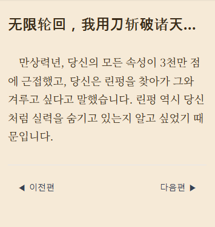
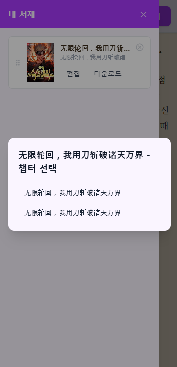

# dowoo

[](LICENSE)
[](https://github.com/sinjinwoo/dowoo/actions/workflows/ci.yml)
[](https://github.com/sinjinwoo/dowoo/actions/workflows/docker-publish.yml)
[](https://hub.docker.com/r/sjw0066/dowoo)
[](https://hub.docker.com/r/sjw0066/dowoo/tags)

사용자가 직접 Google Gemini API 키와 웹소설 사이트 주소(또는 텍스트)를 입력하면, AI가 실시간으로 번역해서 보여주는 셀프호스팅 웹소설 리더. 

[syosetu.colomo.dev](https://syosetu.colomo.dev/)를 참고해 기능을 발전시켜 개발 중.

## 주요 기능

- **아이디/비밀번호 로그인**: 사용자별로 서재·API 키·테마 설정을 분리 저장 (OAuth2는 추후 확장 예정)
- **Gemini API 연동**: API 키 여러 개를 줄 단위로(또는 한 번에 여러 개) 등록하면 요청마다 무작위로 순환 사용(한도 분산), 번역 모델 선택
- **실시간 스트리밍 번역**: 번역문이 도착하는 대로 줄 단위로 화면에 표시, 언제든 취소 가능(취소해도 그때까지 번역된 내용은 저장되어 나중에 이어볼 수 있음), 번역 중에도 이전/다음 편으로 자유롭게 이동 가능
- **웹소설 크롤링**: URL 또는 직접 붙여넣은 텍스트 모두 입력 가능 (지원 사이트는 아래 [지원 사이트](#지원-사이트) 참고)
- **내 서재**: 번역한 소설을 목록으로 관리, 드래그 앤 드롭으로 순서 변경, 소설별 시스템 프롬프트/번역 노트 편집, txt로 다운로드
- **번역 노트(용어집)**: 소설별로 고유명사/인물 이름/말투를 지정해두면 번역 시 자동 반영 (`{{memo}}` 플레이스홀더)
- **읽기 테마**: 폰트(드롭다운에서 폰트별 미리보기)/글자색/배경색/크기/두께/줄간격/들여쓰기 조절, 원클릭 테마 프리셋(다크 모드/미디엄 그린/오렌지 페이퍼, 버튼 자체가 해당 색상으로 표시됨) + 커스텀 테마 저장
- **원문 대조**: 번역 문단을 클릭하면 원문이 작은 글씨로 펼쳐짐
- **모바일 최적화**: 반응형 햄버거 메뉴, 스크롤/탭으로 상단바 숨김·노출

## 스크린샷

| 뷰어 | 서재 |
| --- | --- |
|  |  |

더 많은 화면은 [`docs/screenshots.md`](docs/screenshots.md) 참고 (로그인/회원가입, API 키 관리, 테마 설정 등).

## 지원 사이트

- ixdzs8.com
- m.xsw.tw
- 69shuba.com (www 포함)
- twkan.com

## 아키텍처

셀프호스팅 전제로, Docker 이미지 2개(+ 공식 Postgres 이미지)로 배포한다.

| 서비스 | 스택 | 역할 |
| --- | --- | --- |
| `core-api` | Spring Boot (Java 21) | 로그인/회원, 서재, 챕터, 설정 API, React 빌드 결과물을 정적 리소스로 서빙(SPA + API가 같은 오리진) |
| `ai-api` | FastAPI (Python) | 크롤링, Gemini 스트리밍 번역. 외부에 노출되지 않고 `core-api`만 사설 네트워크에서 호출 가능 |
| `postgres` | PostgreSQL 16 | 사용자 계정, 서재/챕터, API 키(암호화 저장), 테마 설정 저장 |

프론트엔드(`dowoo/`, React + Vite)는 별도 컨테이너 없이 `dowoo-back`의 멀티스테이지 Docker 빌드 과정에서 빌드되어 Spring Boot의 정적 리소스(`src/main/resources/static`)에 포함된다. 즉 브라우저는 `core-api` 하나의 오리진만 바라본다.

API 계약의 자세한 내용은 [`docs/api-spec.md`](docs/api-spec.md), 개발 중 겪은 이슈와 해결 과정은 [`docs/troubleshooting/`](docs/troubleshooting/README.md)를 참고.

## 사용법 (빠른 시작)

Docker / Docker Compose만 설치되어 있으면 된다. 이 저장소를 clone할 필요 없이, 아래 두 파일만 원하는 디렉터리에 만들면 된다.

**`docker-compose.yml`**

```yaml
services:
  postgres:
    image: postgres:16-alpine
    restart: unless-stopped
    environment:
      POSTGRES_DB: ${DB_NAME}
      POSTGRES_USER: ${DB_USER}
      POSTGRES_PASSWORD: ${DB_PASSWORD}
    volumes:
      - postgres-data:/var/lib/postgresql/data
    healthcheck:
      test: ["CMD-SHELL", "pg_isready -U ${DB_USER} -d ${DB_NAME}"]
      interval: 5s
      timeout: 5s
      retries: 10
    networks:
      - dowoo-net

  core-api:
    image: sjw0066/dowoo:${DOWOO_IMAGE_TAG}
    restart: unless-stopped
    env_file: .env
    environment:
      DB_HOST: postgres
      DB_PORT: 5432
      AI_API_BASE_URL: http://ai-api:8000
    depends_on:
      postgres:
        condition: service_healthy
      ai-api:
        condition: service_healthy
    ports:
      - "${CORE_API_PORT}:8080"
    networks:
      - dowoo-net

  ai-api:
    image: sjw0066/dowoo-ai:${DOWOO_IMAGE_TAG}
    restart: unless-stopped
    environment:
      INTERNAL_TOKEN: ${INTERNAL_TOKEN}
    healthcheck:
      test: ["CMD", "python", "-c", "import urllib.request; urllib.request.urlopen('http://localhost:8000/health')"]
      interval: 5s
      timeout: 5s
      retries: 10
    networks:
      - dowoo-net

networks:
  dowoo-net:
    driver: bridge

volumes:
  postgres-data:
```

**`.env`** (`CHANGE_ME`로 표시된 네 개는 `openssl rand -hex 32`로 만든 값으로 바꿀 것 - 안 바꾸면 앱이 기동을 거부한다)

```bash
DB_NAME=dowoo
DB_USER=dowoo
DB_PASSWORD=CHANGE_ME
INTERNAL_TOKEN=CHANGE_ME
API_KEY_ENCRYPTION_SECRET=CHANGE_ME
JWT_SECRET=CHANGE_ME
CORE_API_PORT=8080
DOWOO_IMAGE_TAG=latest
```

두 파일을 같은 디렉터리에 두고 실행:

```bash
docker compose pull
docker compose up -d
```

`http://localhost:8080` (또는 `.env`에서 바꾼 `CORE_API_PORT`)로 접속해서 회원가입 후 사용하면 된다.

```bash
docker compose logs -f core-api    # 로그 확인
docker compose down                # 컨테이너만 정리 (DB 데이터는 volume에 남음)
docker compose down -v             # DB 데이터까지 완전히 삭제
```

**포트를 바꾸고 싶으면** `.env`의 `CORE_API_PORT`만 바꾸고 재시작하면 된다(이미지 재빌드 불필요).

**업데이트/롤백**은 새로 `pull` + `up -d`하면 된다. 문제가 생기면 `.env`의 `DOWOO_IMAGE_TAG`를 이전 버전(예: `1.0.0`, 도커허브 태그 목록에서 확인)으로 바꾸고 다시 `pull` + `up -d`.

## 로컬 개발 / 소스 빌드 (테스트 환경)

아래는 소스를 직접 고치거나 테스트할 때만 필요하다. 일반 사용자는 위 "사용법 (빠른 시작)" 섹션만 보면 된다.

### 소스로 직접 빌드해서 전체 스택 띄우기

저장소 루트의 `docker-compose.yml`(이 파일은 `build:`만 사용하는 개발용 설정)로 로컬 소스를 이미지로 빌드해 띄운다.

```bash
git clone <이 저장소>
cd dowoo
cp .env.example .env   # 값 채우기는 파일 안 주석 참고
docker compose up --build -d
```

### 프론트엔드만 따로 개발

백엔드는 Docker Compose로 띄워둔 상태에서, 프론트엔드만 Vite dev server로 빠르게 개발할 수 있다.

```bash
cd dowoo
npm install
npm run dev
```

`dowoo/.env.development`가 `VITE_API_BASE_URL=http://localhost:8080`을 가리키므로, `docker compose up -d`로 `core-api`가 8080에 떠 있어야 정상 동작한다. 이 방식은 프론트가 Core API와 다른 오리진(5173)에서 뜨기 때문에 CORS 허용이 필요한데, Core API가 기본으로 `http://localhost:5173`을 허용하도록 되어 있어 별도 설정 없이 바로 된다(`app.cors-allowed-origins`, `dowoo-back/src/main/resources/application.properties`).

## 기술 스택

- **프론트엔드**: React 19 + TypeScript + Vite + Tailwind CSS v4, `@dnd-kit`(서재 드래그 앤 드롭)
- **Core API**: Spring Boot 4 (Java 21) + Spring Security(JWT) + Spring Data JPA + Flyway + PostgreSQL
- **AI API**: FastAPI (Python) + `curl_cffi`(Cloudflare 우회 크롤링) + `google-genai`(Gemini 스트리밍)

## Contributing

버그 리포트/기능 제안은 [Issues](https://github.com/sinjinwoo/dowoo/issues)에, 코드 기여는 PR로 부탁드립니다. 개발 환경 설정, 브랜치/커밋 규칙, 새 크롤링 사이트 추가 방법 등은 [`CONTRIBUTING.md`](CONTRIBUTING.md)를 참고하세요.

## License

This project is licensed under the MIT License - see [`LICENSE`](LICENSE) for details.

## Author

[신진우 (sinjinwoo)](https://github.com/sinjinwoo)
