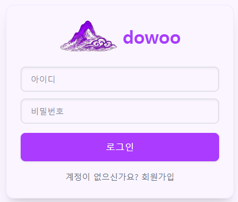
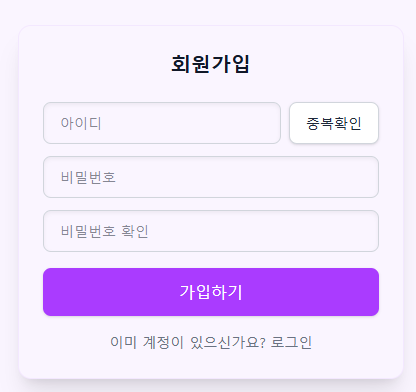
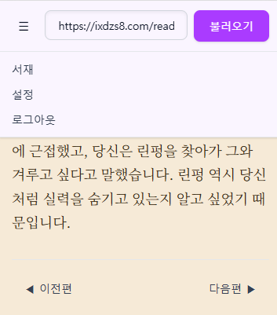
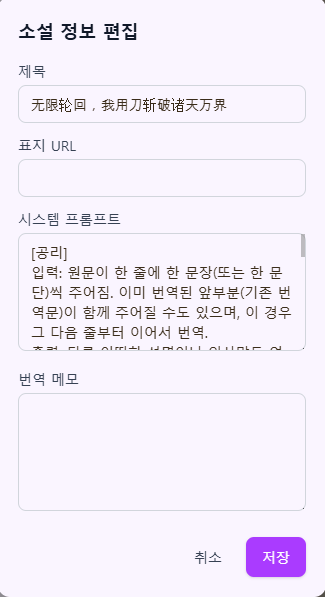
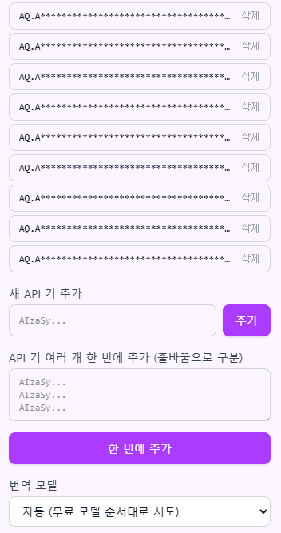
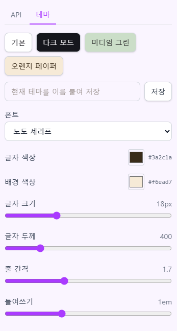

# 스크린샷

## 로그인 / 회원가입

아이디·비밀번호 기반 로그인. 회원가입 시 아이디 중복확인을 바로 할 수 있다.

| 로그인 | 회원가입 |
| --- | --- |
|  |  |

## URL 입력 및 상단 탭

주소창에 소설 URL을 붙여넣고 "불러오기"를 누르면 크롤링 후 번역이 시작된다. 상단 탭에서 서재/설정/로그아웃으로 이동한다.

## 기본 뷰어

번역문이 실시간 스트리밍으로 표시되며, 하단에서 이전편/다음편으로 이동할 수 있다.

## 내 서재 / 챕터 선택

번역한 소설이 서재에 목록으로 쌓이고, 소설을 클릭하면 이미 번역해둔 챕터 목록에서 원하는 회차를 골라 열 수 있다.

## 서재 정보 편집

소설별로 제목/표지 URL/시스템 프롬프트/번역 메모(용어집)를 직접 편집할 수 있다.

## API 키 및 모델 관리

Gemini API 키를 여러 개 등록(줄바꿈으로 구분해 한 번에 추가 가능)해두면 요청마다 순환 사용된다. 번역 모델도 선택할 수 있다.

## 테마 설정

다크 모드/미디엄 그린/오렌지 페이퍼 원클릭 프리셋과, 폰트·글자색·배경색·크기·두께·줄간격·들여쓰기 세부 조절, 커스텀 테마 저장을 지원한다.

